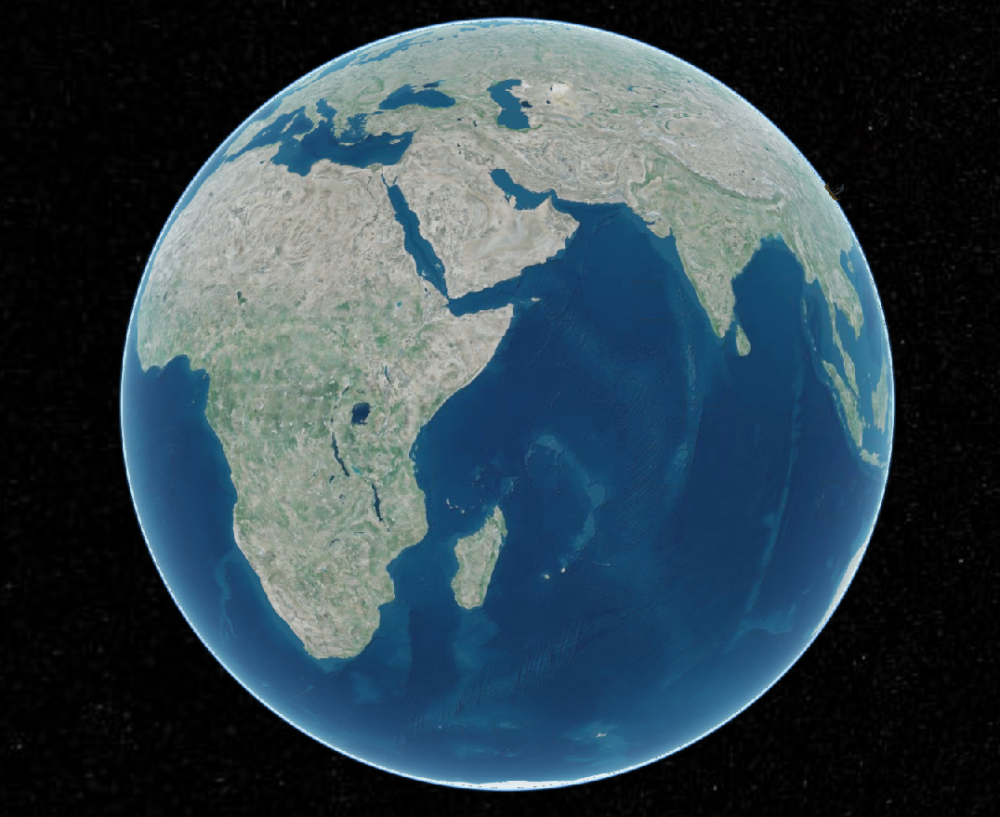
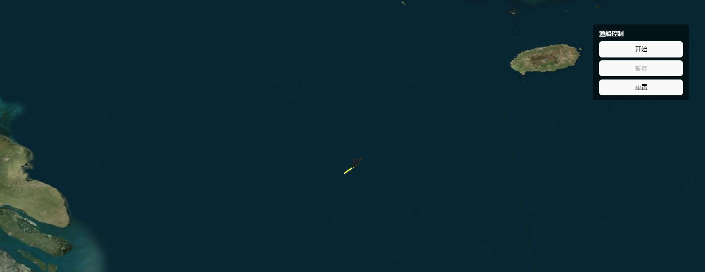
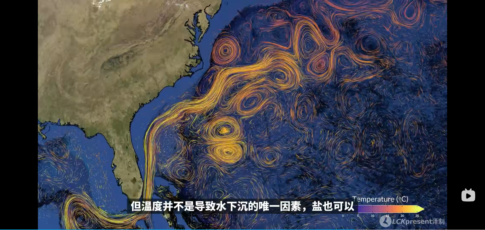
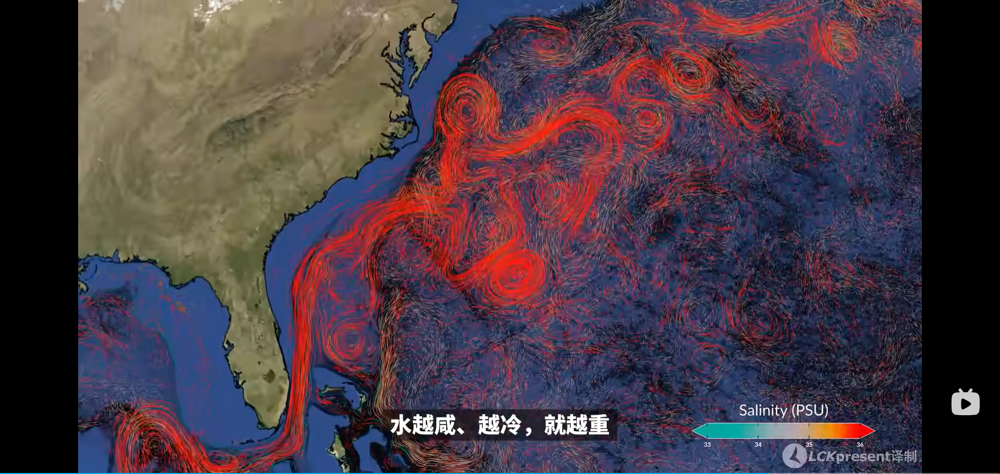
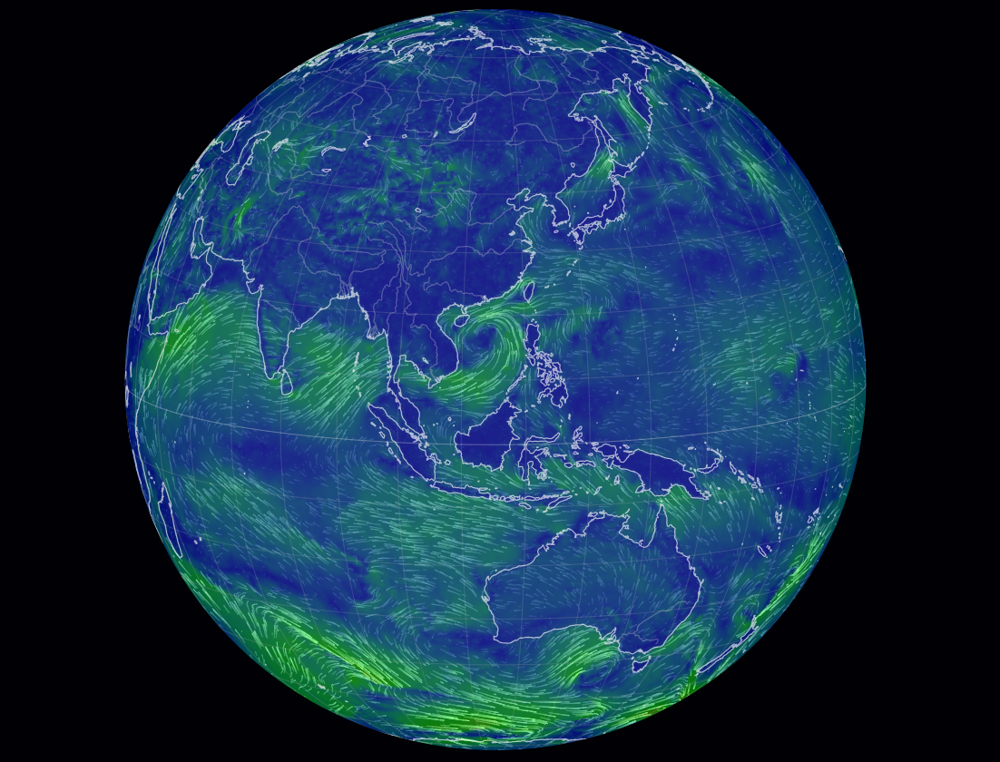
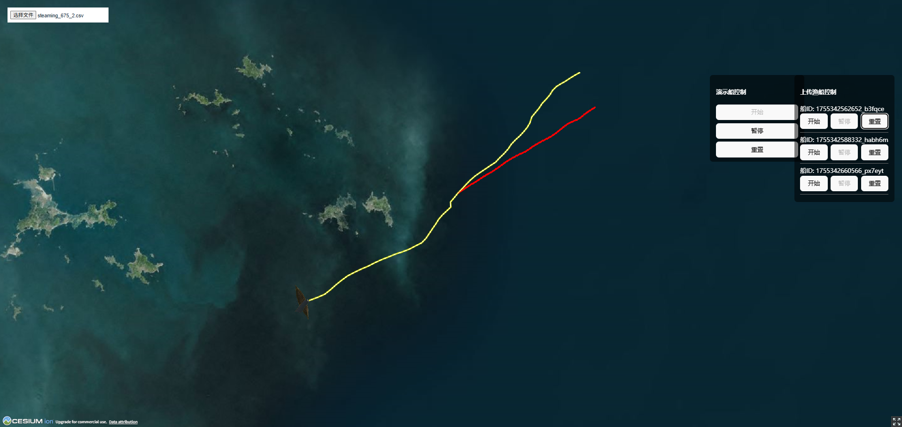
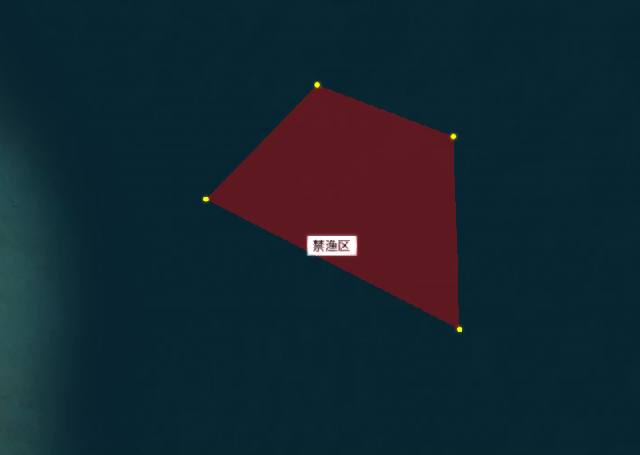
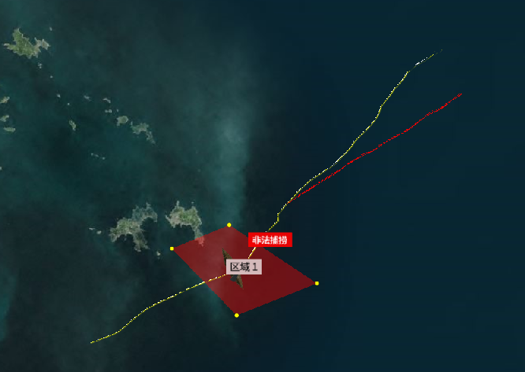
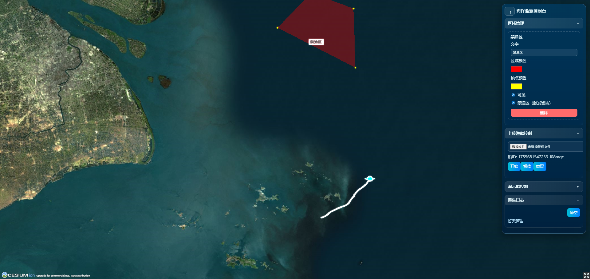

# React + Vite

This template provides a minimal setup to get React working in Vite with HMR and some ESLint rules.

Currently, two official plugins are available:

- [@vitejs/plugin-react](https://github.com/vitejs/vite-plugin-react/blob/main/packages/plugin-react) uses [Babel](https://babeljs.io/) for Fast Refresh
- [@vitejs/plugin-react-swc](https://github.com/vitejs/vite-plugin-react/blob/main/packages/plugin-react-swc) uses [SWC](https://swc.rs/) for Fast Refresh

## Expanding the ESLint configuration

If you are developing a production application, we recommend using TypeScript with type-aware lint rules enabled. Check out the [TS template](https://github.com/vitejs/vite/tree/main/packages/create-vite/template-react-ts) for information on how to integrate TypeScript and [`typescript-eslint`](https://typescript-eslint.io) in your project.

## TimeLine

### 0813

实现了精细化地球，使用的是cesiumJS

初步的展示打算是从3D地球聚焦到具体海域，然后进行轨迹预测展示

### 0814

把渔船模型加载进来，并给出了轨迹可视化的初步方案

问题：海水太暗，渔船太小看不清，渔船太大覆盖轨迹太多，轨迹太短

### 0815

这个好像是NASA做的可视化，看起来很牛【【中字】海洋的律动：令人着迷的洋流数据可视化模型】 https://www.bilibili.com/video/BV1pMVaz5EUs/?share_source=copy_web&vd_source=fc070803b757e0e1cc734f0d5b241b0b

感觉可以把洋流可视化也做进来，效果比较唬人

这样一些水文数据：海洋温度、海洋盐度分布也可以做进来

我还发现了一个海洋可视化的网站，还是实时更新的

https://earth.nullschool.net/zh-cn/

这些效果太强了，我连对应的数据集都没找到在哪

先把这个东西放放，后面有时间再来做

### 0816

把轨迹上传功能加进来

轨迹太短，渔船模型太小，海洋太深看不清渔船的位置，但轨迹确实已经可以显示出来了，也做了多船的控制和视角移动

下一步准备做捕鱼/禁渔区的标记了

### 0818

单击打点，右击完成区域封闭并命名，右侧控制面板可以修改文字、区域颜色、顶点颜色、可见、是否为禁渔区（方便后续警告触发）

### 0820

把轨迹和区域做联动，当渔船轨迹经过禁渔区后，产生警告，离开后警告消失，所有警告会被存到日志里

### 0821

整理现有的所有控制面板，修改样式

增强轨迹可见性，增强渔船亮度

后面可能会再精细调整一下轨迹的表现方式，以及渔船的表现方式。
